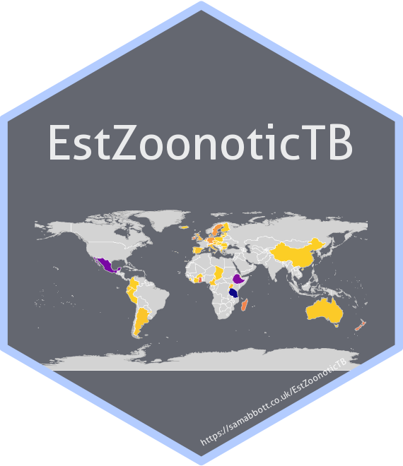

```{r, echo = FALSE}
knitr::opts_chunk$set(
  collapse = TRUE,
  comment = "#>",
  fig.path = "man/figures/"
)
```

# `{EstZoonoticTB}`: an R package for exploring, visualising and estimating the global zoonotic tuberculosis burden  

[](https://mybinder.org/v2/gh/seabbs/EstZoonoticTB/master?urlpath=rstudio) 
[](https://github.com/seabbs/EstZoonoticTB)
[](https://zenodo.org/badge/latestdoi/112591837)


`{EstZoonoticTB}` is an R package containing data relevant to global zoonotic tuberculosis (TB), tools for manipulating and visualising this data, and analysis aiming to improve country level estimates of zoonotic TB. Packaged datasets include: cleaned data from [a recent systematic review](https://www.ncbi.nlm.nih.gov/pmc/articles/PMC4816377/); data on the country specific epidemiology of TB; demographic data (including data on the rural populations); animal demographic data; and data on the presence of zoonotic TB in animal populations (both domesticated and wild). Tooling includes functions for linking the built in datasets (built with the aim of accommodating external data sources), data mappping functions, and conveniance functions for manipulating the linked datasets. See the package vignettes for further details. 

## Installation

Install the development version from GitHub:

```{r gh-installation, eval = FALSE}
# install.packages("remotes")
remotes::install_github("seabbs/EstZoonoticTB")
```

## Documentation

### Overview

[](https://www.samabbott.co.uk/EstZoonoticTB/)
[](https://www.samabbott.co.uk/EstZoonoticTB/dev)
[](https://www.samabbott.co.uk/EstZoonoticTB/reference/index.html)

### Vignettes

[](https://www.samabbott.co.uk/EstZoonoticTB/reference/data-sources.html)
[](https://www.samabbott.co.uk/EstZoonoticTB/reference/data-exploration.html)
[](https://www.samabbott.co.uk/EstZoonoticTB/reference/data-mapping.html)


## Testing

[](https://travis-ci.org/seabbs/EstZoonoticTB)
[](https://ci.appveyor.com/project/seabbs/EstZoonoticTB)
[](https://codecov.io/github/seabbs/EstZoonoticTB?branch=master)


## Data

The package comes prepackaged with multiple datasets that can then be linked into a single dataset ready for analysis. This linked dataset can be accessed using the following,

```{r}
EstZoonoticTB::link_data(verbose = FALSE)
```

See the package vignettes for details.

## Shiny dashboard

*Work in progress*

To explore the package functionality in an interactive session, or to investigate Zoonotic TB without having to code extensively in R, a shiny dashboard has been built into the package. This can either be used locally using, 

```{r run-dash, eval = FALSE}
EstZoonoticTB::dashboard()
```

Or accessed online.

## Contributing

File an issue [here](https://github.com/seabbs/EstZoonoticTB/issues) if there is a feature, or a dataset, that you think is missing from the package, or better yet submit a pull request!

Please note that the `EstZoonoticTB` project is released with a [Contributor Code of Conduct](https://github.com/seabbs/EstZoonoticTB/blob/master/.github/CODE_OF_CONDUCT.md). By contributing to this project, you agree to abide by its terms.

## Citing 

If using `EstZoonoticTB` please consider citing the package in the relevant work. Citation information can be generated in R using the following (after installing the package),

```{r}
citation("EstZoonoticTB")
```

## Docker

This package has been developed in docker based on the `rocker/geospatial` image, to access the  development environment enter the following at the command line (with an active docker daemon running),

```{bash, eval = FALSE}
docker pull seabbs/estzoonotictb
docker run -d -p 8787:8787 -e USER=EstZoonoticTB -e PASSWORD=EstZoonoticTB --name EstZoonoticTB seabbs/estzoonotictb
```

The rstudio client can be accessed on port `8787` at `localhost` (or your machines ip). The default username is EstZoonoticTB and the default password is EstZoonoticTB. Alternatively, access the development environment via [binder](https://mybinder.org/v2/gh/seabbs/EstZoonoticTB/master?urlpath=rstudio).

