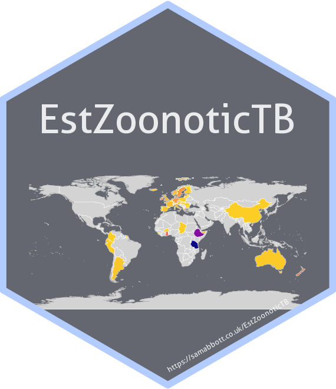

# EstZoonoticTB: an R package for estimating and visualising zoonotic TB 

[](https://mybinder.org/v2/gh/seabbs/EstZoonoticTB/master?urlpath=rstudio)
[](https://CRAN.R-project.org/package=EstZoonoticTB)
[](https://github.com/seabbs/EstZoonoticTB)
[](https://zenodo.org/badge/latestdoi/112591837)

## Installation

Install the development version from GitHub:

``` r
# install.packages("remotes")
remotes::install_github("seabbs/EstZoonoticTB")
```

## Documentation

[](https://www.samabbott.co.uk/EstZoonoticTB/)
[](https://www.samabbott.co.uk/EstZoonoticTB/dev)
[](https://www.samabbott.co.uk/EstZoonoticTB/reference/index.html)

## Testing

[](https://travis-ci.org/seabbs/EstZoonoticTB)
[](https://ci.appveyor.com/project/seabbs/EstZoonoticTB)
[](https://codecov.io/github/seabbs/EstZoonoticTB?branch=master)

## Quick start

## Shiny dashboard

To explore the package functionality in an interactive session, or to
investigate Zoonotic TB without having to code extensively in R, a shiny
dashboard has been built into the package. This can either be used
locally using,

``` r
EstZoonoticTB::dashboard()
```

Or accessed online.

## Contributing

File an issue [here](https://github.com/seabbs/EstZoonoticTB/issues) if
there is a feature, or a dataset, that you think is missing from the
package, or better yet submit a pull request\!

Please note that the `EstZoonoticTB` project is released with a
[Contributor Code of
Conduct](https://github.com/seabbs/EstZoonoticTB/blob/master/.github/CODE_OF_CONDUCT.md).
By contributing to this project, you agree to abide by its terms.

## Citing

If using `EstZoonoticTB` please consider citing the package in the
relevant work. Citation information can be generated in R using the
following (after installing the package),

``` r
citation("EstZoonoticTB")
#> 
#> To cite EstZoonoticTB in publications use:
#> 
#>   Sam Abbott (2019). EstZoonoticTB: an R package for estimating
#>   and visualising zoonotic TB
#> 
#> A BibTeX entry for LaTeX users is
#> 
#>   @Article{,
#>     title = {EstZoonoticTB: an R package for estimating and visualising zoonotic TB},
#>     author = {Sam Abbott},
#>     journal = {-},
#>     year = {-},
#>     volume = {-},
#>     number = {-},
#>     pages = {-},
#>     doi = {-},
#>   }
```

## Docker

This package has been developed in docker based on the
`rocker/geospatial` image, to access the development environment enter
the following at the command line (with an active docker daemon
running),

``` bash
docker pull seabbs/estzoonotictb
docker run -d -p 8787:8787 -e USER=EstZoonoticTB -e PASSWORD=EstZoonoticTB --name EstZoonoticTB seabbs/estzoonotictb
```

The rstudio client can be accessed on port `8787` at `localhost` (or
your machines ip). The default username is EstZoonoticTB and the default
password is EstZoonoticTB. Alternatively, access the development
environment via
[binder](https://mybinder.org/v2/gh/seabbs/EstZoonoticTB/master?urlpath=rstudio).
