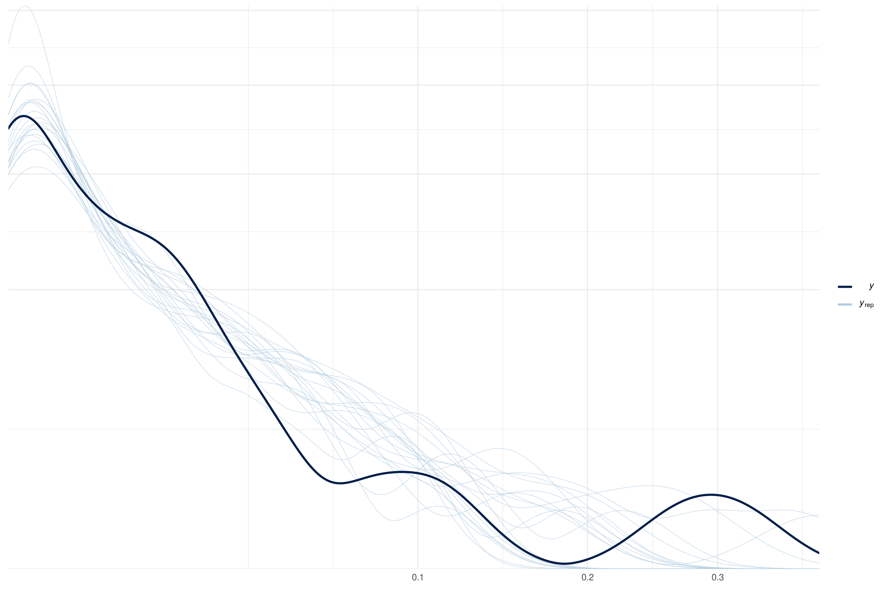

## Overview


*Work in progress*

## Data preparation


* Get all data


```r
all_data <- link_data(verbose = FALSE)

all_data
#> # A tibble: 15,465 x 26
#>    country country_code g_whoregion  year tb_cases tb_inc tb_inc_lo tb_inc_hi
#>    <fct>   <fct>        <fct>       <dbl>    <int>  <dbl>     <dbl>     <dbl>
#>  1 Afghan… AFG          Eastern Me…  2000    39000    190       123       271
#>  2 Afghan… AFG          Eastern Me…  2001    41000    189       123       271
#>  3 Afghan… AFG          Eastern Me…  2002    43000    189       122       270
#>  4 Afghan… AFG          Eastern Me…  2003    45000    189       122       270
#>  5 Afghan… AFG          Eastern Me…  2004    47000    189       122       270
#>  6 Afghan… AFG          Eastern Me…  2005    48000    189       122       270
#>  7 Afghan… AFG          Eastern Me…  2006    50000    189       122       270
#>  8 Afghan… AFG          Eastern Me…  2007    51000    189       122       270
#>  9 Afghan… AFG          Eastern Me…  2008    52000    189       122       270
#> 10 Afghan… AFG          Eastern Me…  2009    54000    189       123       270
#> # … with 15,455 more rows, and 18 more variables: prop_tb_ep <dbl>,
#> #   prop_hiv <dbl>, prop_hiv_lo <dbl>, prop_hiv_hi <dbl>,
#> #   z_tb_dom_animal <fct>, z_tb_wild_animal <fct>, z_tb_id <int>,
#> #   z_tb_geo_coverage <fct>, z_tb_study_pop <fct>, z_tb_multi_year_study <fct>,
#> #   tb_z_prop <dbl>, tb_z_prop_lo <dbl>, tb_z_prop_hi <dbl>,
#> #   tb_z_prop_se <dbl>, population <dbl>, prop_rural <dbl>, cattle <int>,
#> #   cattle_per_head <dbl>
```

* Drop countries with a TB incidence rate of less than 1 in 100,000 or with incidence of less than 100. Restrict dataset to 2000 onwards.


```r
df_with_filt_tb <- all_data %>% 
  dplyr::filter(tb_cases >= 100, tb_inc >= 1) %>% 
  dplyr::filter(year >= 2000)

df_with_filt_tb 
#> # A tibble: 3,256 x 26
#>    country country_code g_whoregion  year tb_cases tb_inc tb_inc_lo tb_inc_hi
#>    <fct>   <fct>        <fct>       <dbl>    <int>  <dbl>     <dbl>     <dbl>
#>  1 Afghan… AFG          Eastern Me…  2000    39000    190       123       271
#>  2 Afghan… AFG          Eastern Me…  2001    41000    189       123       271
#>  3 Afghan… AFG          Eastern Me…  2002    43000    189       122       270
#>  4 Afghan… AFG          Eastern Me…  2003    45000    189       122       270
#>  5 Afghan… AFG          Eastern Me…  2004    47000    189       122       270
#>  6 Afghan… AFG          Eastern Me…  2005    48000    189       122       270
#>  7 Afghan… AFG          Eastern Me…  2006    50000    189       122       270
#>  8 Afghan… AFG          Eastern Me…  2007    51000    189       122       270
#>  9 Afghan… AFG          Eastern Me…  2008    52000    189       122       270
#> 10 Afghan… AFG          Eastern Me…  2009    54000    189       123       270
#> # … with 3,246 more rows, and 18 more variables: prop_tb_ep <dbl>,
#> #   prop_hiv <dbl>, prop_hiv_lo <dbl>, prop_hiv_hi <dbl>,
#> #   z_tb_dom_animal <fct>, z_tb_wild_animal <fct>, z_tb_id <int>,
#> #   z_tb_geo_coverage <fct>, z_tb_study_pop <fct>, z_tb_multi_year_study <fct>,
#> #   tb_z_prop <dbl>, tb_z_prop_lo <dbl>, tb_z_prop_hi <dbl>,
#> #   tb_z_prop_se <dbl>, population <dbl>, prop_rural <dbl>, cattle <int>,
#> #   cattle_per_head <dbl>
```

* Drop data on presence/absence of zoonotic TB in animals. Drop variables not used in further analysis. 


```r
analysis_df <- df_with_filt_tb %>% 
  dplyr::select(-z_tb_dom_animal, -z_tb_wild_animal, 
                -country_code, - tb_cases, -z_tb_id, -z_tb_geo_coverage,
                -z_tb_study_pop, -tb_z_prop_lo, -tb_z_prop_hi,
                -cattle, -z_tb_multi_year_study) %>% 
  dplyr::mutate(id = 1:n())
                
analysis_df
#> # A tibble: 3,256 x 16
#>    country g_whoregion  year tb_inc tb_inc_lo tb_inc_hi prop_tb_ep prop_hiv
#>    <fct>   <fct>       <dbl>  <dbl>     <dbl>     <dbl>      <dbl>    <dbl>
#>  1 Afghan… Eastern Me…  2000    190       123       271     0.0415  0.00321
#>  2 Afghan… Eastern Me…  2001    189       123       271     0.0622  0.00344
#>  3 Afghan… Eastern Me…  2002    189       122       270     0.0769  0.00217
#>  4 Afghan… Eastern Me…  2003    189       122       270     0.0723  0.00259
#>  5 Afghan… Eastern Me…  2004    189       122       270     0.0809  0.00280
#>  6 Afghan… Eastern Me…  2005    189       122       270     0.103   0.00307
#>  7 Afghan… Eastern Me…  2006    189       122       270     0.101   0.00323
#>  8 Afghan… Eastern Me…  2007    189       122       270     0.122   0.00397
#>  9 Afghan… Eastern Me…  2008    189       122       270     0.118   0.00386
#> 10 Afghan… Eastern Me…  2009    189       123       270     0.106   0.00413
#> # … with 3,246 more rows, and 8 more variables: prop_hiv_lo <dbl>,
#> #   prop_hiv_hi <dbl>, tb_z_prop <dbl>, tb_z_prop_se <dbl>, population <dbl>,
#> #   prop_rural <dbl>, cattle_per_head <dbl>, id <int>
```
* Check data structure


```r
analysis_df %>% 
  summary
#>                         country                    g_whoregion       year     
#>  Argentina                  :  23   Africa               :865   Min.   :2000  
#>  China                      :  21   Americas             :518   1st Qu.:2004  
#>  Ethiopia                   :  20   Eastern Mediterranean:381   Median :2009  
#>  United Republic of Tanzania:  20   Europe               :865   Mean   :2009  
#>  Afghanistan                :  19   South-East Asia      :207   3rd Qu.:2014  
#>  Albania                    :  19   Western Pacific      :420   Max.   :2018  
#>  (Other)                    :3134                                             
#>      tb_inc         tb_inc_lo        tb_inc_hi        prop_tb_ep     
#>  Min.   :   1.3   Min.   :  1.10   Min.   :   1.5   Min.   :0.00000  
#>  1st Qu.:  22.0   1st Qu.: 18.75   1st Qu.:  27.0   1st Qu.:0.07581  
#>  Median :  69.5   Median : 52.00   Median :  88.0   Median :0.12000  
#>  Mean   : 150.8   Mean   :104.64   Mean   : 206.4   Mean   :0.14633  
#>  3rd Qu.: 206.0   3rd Qu.:140.00   3rd Qu.: 291.0   3rd Qu.:0.19359  
#>  Max.   :1280.0   Max.   :908.00   Max.   :1830.0   Max.   :0.58491  
#>                                                     NA's   :64       
#>     prop_hiv        prop_hiv_lo       prop_hiv_hi        tb_z_prop     
#>  Min.   :0.00000   Min.   :0.00000   Min.   :0.00000   Min.   :0.0000  
#>  1st Qu.:0.01350   1st Qu.:0.00455   1st Qu.:0.03151   1st Qu.:0.0000  
#>  Median :0.05922   Median :0.02100   Median :0.12500   Median :0.0027  
#>  Mean   :0.12881   Mean   :0.05414   Mean   :0.29975   Mean   :0.0140  
#>  3rd Qu.:0.16832   3rd Qu.:0.06569   3rd Qu.:0.39131   3rd Qu.:0.0134  
#>  Max.   :0.84175   Max.   :0.52500   Max.   :2.08974   Max.   :0.3143  
#>  NA's   :126       NA's   :126       NA's   :126       NA's   :3126    
#>   tb_z_prop_se      population          prop_rural     cattle_per_head  
#>  Min.   :0.0001   Min.   :5.206e+04   Min.   :0.0000   Min.   :0.00003  
#>  1st Qu.:0.0017   1st Qu.:3.438e+06   1st Qu.:0.2528   1st Qu.:0.06572  
#>  Median :0.0038   Median :9.456e+06   Median :0.4358   Median :0.17390  
#>  Mean   :0.0080   Mean   :4.090e+07   Mean   :0.4383   Mean   :0.29572  
#>  3rd Qu.:0.0085   3rd Qu.:2.758e+07   3rd Qu.:0.6249   3rd Qu.:0.33954  
#>  Max.   :0.0879   Max.   :1.447e+09   Max.   :0.9176   Max.   :3.77728  
#>  NA's   :3126     NA's   :5           NA's   :5        NA's   :243      
#>        id        
#>  Min.   :   1.0  
#>  1st Qu.: 814.8  
#>  Median :1628.5  
#>  Mean   :1628.5  
#>  3rd Qu.:2442.2  
#>  Max.   :3256.0  
#> 
```

## Bootstrapping


* Simulate 1000 data points per row using all variable uncertainty. For variables that have no measure of uncertainty a standard error of 2.5% has been assumed. Use multiple imputation to deal with any missing data in each sample.


```r
# Define required bootstrapping
bootstrap_uncertainty <- function(df = NULL, samples = NULL) {
  out <- df %>% 
  ## Move proportions away from 0 and 1 by a small amount for beta distribution
  dplyr::mutate(tb_z_prop = ifelse(tb_z_prop == 0, 1e-5, 
                            ifelse(tb_z_prop == 1, 1 - 1e-5, tb_z_prop))) %>% 
  dplyr::mutate(., sample = 0)
  
  if (samples > 1) {
    out <-   out %>% 
    ## Hold out the original data as a point estimate sample
      {bind_rows(mutate(., sample = 0),
               ## Add noise for variables that we have information about
               
                mutate(., prop_hiv = purrr::map2(prop_hiv, prop_hiv_hi, ~ 
                                                   rtruncnorm(samples - 1, a = 0, b = 1,
                                                              mean = .x, 
                                                              sd = (.y - .x) / 1.96)),
                      tb_inc = purrr::map2(tb_inc, tb_inc_hi, ~ 
                                                   rtruncnorm(samples - 1, a = 0, b = 1,
                                                              mean = .x, 
                                                              sd = (.y - .x) / 1.96)),
                       tb_z_prop = purrr::map2(tb_z_prop, tb_z_prop_se, ~ 
                                                 rtruncnorm(samples - 1, a = 1e-5, 
                                                            b = (1 - 1e-5), 
                                                            mean = .x, sd = .y))) %>% 
                ## Add a 2.5% SE normal noise for numeric variables with no noise.
                mutate_at(.vars = vars(cattle_per_head), 
                          ~ purrr::map(., ~ rtruncnorm(samples - 1, a = 0, 
                                                       mean = ., sd = . * 0.025))) %>% 
                mutate_at(.vars = vars(prop_tb_ep, prop_rural), 
                          ~ purrr::map(., ~ rtruncnorm(samples - 1, a = 0, b = 1, 
                                                       mean = ., sd = . * 0.025))) %>% 
                mutate(sample = list(tibble::tibble(sample = 1:(samples - 1)))) %>% 
                tidyr::unnest(cols = c(prop_tb_ep, prop_hiv, tb_z_prop, 
                                       prop_rural, cattle_per_head, sample)),
             )}
  }
  
  ## Drop uncertainty variables
  out <- out %>% 
  dplyr::select(-prop_hiv_lo, -prop_hiv_hi, -tb_z_prop_se, -tb_inc_hi, -tb_inc_lo)
  
  return(out)
}

# Define by sample imputation
impute_per_sample <- function(df = NULL, maxit = 20) {
  out <- df %>% 
  dplyr::group_split(sample) %>% 
  purrr::map(~ dplyr::bind_cols(dplyr::select(., tb_z_prop, population, id),
                                dplyr::select(., -tb_z_prop, -id, -population) %>% 
                                  mice::mice(m = 1, maxit = maxit) %>% 
                                  mice::complete()
                    )) %>% 
  dplyr::bind_rows()
  
  return(out)
}


bootstrapped_df_all <- analysis_df %>% 
  bootstrap_uncertainty(samples = 1) %>% 
  impute_per_sample()
#> 
#>  iter imp variable
#>   1   1  prop_tb_ep*  prop_hiv*  prop_rural*  cattle_per_head*
#>   2   1  prop_tb_ep*  prop_hiv*  prop_rural*  cattle_per_head*
#>   3   1  prop_tb_ep*  prop_hiv*  prop_rural*  cattle_per_head*
#>   4   1  prop_tb_ep*  prop_hiv*  prop_rural*  cattle_per_head*
#>   5   1  prop_tb_ep*  prop_hiv*  prop_rural*  cattle_per_head*
#>   6   1  prop_tb_ep*  prop_hiv*  prop_rural*  cattle_per_head*
#>   7   1  prop_tb_ep*  prop_hiv*  prop_rural*  cattle_per_head*
#>   8   1  prop_tb_ep*  prop_hiv*  prop_rural*  cattle_per_head*
#>   9   1  prop_tb_ep*  prop_hiv*  prop_rural*  cattle_per_head*
#>   10   1  prop_tb_ep*  prop_hiv*  prop_rural*  cattle_per_head*
#>   11   1  prop_tb_ep*  prop_hiv*  prop_rural*  cattle_per_head*
#>   12   1  prop_tb_ep*  prop_hiv*  prop_rural*  cattle_per_head*
#>   13   1  prop_tb_ep*  prop_hiv*  prop_rural*  cattle_per_head*
#>   14   1  prop_tb_ep*  prop_hiv*  prop_rural*  cattle_per_head*
#>   15   1  prop_tb_ep*  prop_hiv*  prop_rural*  cattle_per_head*
#>   16   1  prop_tb_ep*  prop_hiv*  prop_rural*  cattle_per_head*
#>   17   1  prop_tb_ep*  prop_hiv*  prop_rural*  cattle_per_head*
#>   18   1  prop_tb_ep*  prop_hiv*  prop_rural*  cattle_per_head*
#>   19   1  prop_tb_ep*  prop_hiv*  prop_rural*  cattle_per_head*
#>   20   1  prop_tb_ep*  prop_hiv*  prop_rural*  cattle_per_head*
#>  * Please inspect the loggedEvents
#> Warning: Number of logged events: 161


bootstrapped_df_all
#> # A tibble: 3,256 x 12
#>    tb_z_prop population    id country g_whoregion  year tb_inc prop_tb_ep
#>        <dbl>      <dbl> <int> <fct>   <fct>       <dbl>  <dbl>      <dbl>
#>  1        NA   20093756     1 Afghan… Eastern Me…  2000    190     0.0415
#>  2        NA   20966463     2 Afghan… Eastern Me…  2001    189     0.0622
#>  3        NA   21979923     3 Afghan… Eastern Me…  2002    189     0.0769
#>  4        NA   23064851     4 Afghan… Eastern Me…  2003    189     0.0723
#>  5        NA   24118979     5 Afghan… Eastern Me…  2004    189     0.0809
#>  6        NA   25070798     6 Afghan… Eastern Me…  2005    189     0.103 
#>  7        NA   25893450     7 Afghan… Eastern Me…  2006    189     0.101 
#>  8        NA   26616792     8 Afghan… Eastern Me…  2007    189     0.122 
#>  9        NA   27294031     9 Afghan… Eastern Me…  2008    189     0.118 
#> 10        NA   28004331    10 Afghan… Eastern Me…  2009    189     0.106 
#> # … with 3,246 more rows, and 4 more variables: prop_hiv <dbl>,
#> #   prop_rural <dbl>, cattle_per_head <dbl>, sample <dbl>
```


* Filter down to just countries with data on zoonotic TB presence from 2000 onwards.


```r
bootstrapped_df <- bootstrapped_df_all %>% 
  tidyr::drop_na(tb_z_prop)

bootstrapped_df
#> # A tibble: 130 x 12
#>    tb_z_prop population    id country g_whoregion  year tb_inc prop_tb_ep
#>        <dbl>      <dbl> <int> <fct>   <fct>       <dbl>  <dbl>      <dbl>
#>  1   0.0246    37057452    77 Argent… Americas     2000   37        0.127
#>  2   0.0124    38309379    80 Argent… Americas     2003   33        0.151
#>  3   0.00001   38309379    81 Argent… Americas     2003   33        0.151
#>  4   0.0121    38309379    82 Argent… Americas     2003   33        0.151
#>  5   0.0354    39145488    84 Argent… Americas     2005   31        0.130
#>  6   0.00340   39145488    85 Argent… Americas     2005   31        0.130
#>  7   0.00288   39558890    86 Argent… Americas     2006   28        0.115
#>  8   0.0102    39558890    87 Argent… Americas     2006   28        0.115
#>  9   0.00261   19065837   119 Austra… Western Pa…  2000    6.3      0.308
#> 10   0.00130   19268533   120 Austra… Western Pa…  2001    5.9      0.338
#> # … with 120 more rows, and 4 more variables: prop_hiv <dbl>, prop_rural <dbl>,
#> #   cattle_per_head <dbl>, sample <dbl>
```


## Modelling

Method derived from here: https://link.springer.com/article/10.1007%2Fs11222-016-9649-y


* Using WAIC/LOO gives a nearly unbiased assessment of performance so can drop training and test.
* Variance in these measures may still result in overfitting if not used in a principled manner.
* Using LOO etc for choosing model size rather than parameter combinations greatly reduces over fitting.   

### Models to be fitted

* All explanatory confounders, using horseshoe priors for regularisation.
* All explanatory confounders with pairwise interactions, using horseshoe priors for regularisation.
* All explanatory confounders, using penalised splines.
* All explanatory confounders using penalised splines and linear pairwise interactions.


```r

## Interaction terms
interactions <- "year:prop_tb_ep + year:prop_hiv + year:prop_rural + year:cattle_per_head + 
    prop_tb_ep:prop_hiv + prop_tb_ep:prop_rural + prop_tb_ep:cattle_per_head + 
    prop_hiv:prop_rural + prop_hiv:cattle_per_head + prop_rural:cattle_per_head"

## Define models
models <- tibble(
  model = c(
    "linear", 
    "linear_int",
    "spline",
    "spline_int"
  ),
  formula = c(
    "bf(tb_z_prop ~  year + prop_tb_ep + prop_hiv + prop_rural + cattle_per_head)",
    paste0("bf(tb_z_prop ~  year + prop_tb_ep + prop_hiv + prop_rural + cattle_per_head + 
    ", interactions, ")"),
    "bf(tb_z_prop ~ s(year, k = 5) + s(prop_tb_ep) + s(prop_hiv) + s(prop_rural) + s(cattle_per_head))",
    paste0("bf(tb_z_prop ~  s(year, k = 5) + s(prop_tb_ep) + s(prop_hiv) + s(prop_rural) + s(cattle_per_head) + 
    ", interactions, ")")
  )
) %>% 
  mutate(formula = stringr::str_replace(formula, "\\n  ", ""))
#> mutate: changed 2 values (50%) of 'formula' (0 new NA)
```


### Model fitting


* Set up model fitting and convergance checking


```r
## Split sampled data into seperate data.frames
split_df <- bootstrapped_df %>% 
    group_split(sample) %>% 
    purrr::map(~ mutate_at(., .vars = vars(year, prop_tb_ep, prop_hiv, 
                           prop_rural, cattle_per_head), scale)) %>% 
    purrr::map(as.data.frame)
#> mutate_at: changed 130 values (100%) of 'year' (0 new NA)
#>            changed 130 values (100%) of 'prop_tb_ep' (0 new NA)
#>            changed 130 values (100%) of 'prop_hiv' (0 new NA)
#>            changed 130 values (100%) of 'prop_rural' (0 new NA)
#>            changed 130 values (100%) of 'cattle_per_head' (0 new NA)


## Fit a model for each sample and aggregate using Rubins rules (process originally designed for imputed data).
fit_model <- purrr::partial(
  brm_multiple,
  data = split_df,
  family = Beta(link = "logit", link_phi = "log"),
  control = list(adapt_delta = 0.999, max_treedepth = 20),
  sample_prior = "yes",
  iter = 2000,
  warmup = 1000,
  thin = 1,
  prior = c(prior(horseshoe(1), class = "b")),
  future = TRUE,
  refresh = 0,
  chains = 2
)


check_convergence <- function(model = NULL) {
  
  large_rhat <- model$rhats %>% 
  summarise_all(max) %>% 
  t() %>% 
  as_tibble(rownames = "variable") %>% 
  filter(V1 > 1.1)

if (nrow(large_rhat) > 0) {
  warning("Model may not have converged")
  return(large_rhat)
}else{
    return(1)
  }
}
```

* Fit all models


```r
refit <- FALSE

if (refit | !file.exists("results/fitted_model.rds")) {
## Set up parallel processing
plan(multiprocess)

## Fit models (silenced output)
results <- models %>% 
  ## Fit each model across multiple samples
  dplyr::mutate(fit = purrr::map(formula,
                                 ~ fit_model(formula = as.formula(.))))

saveRDS(results, "results/fitted_model.rds")

}else{
  results <- readRDS("results/fitted_model.rds")
}

## Check convergance
results <- results %>% 
         ## Check convergence by looking at maximum Rhats across sampled fits. 
         dplyr::mutate(convergence = purrr::map(fit, ~ check_convergence(.)))
#> summarise_all: now one row and 11 columns, ungrouped
#> Warning: `as_tibble.matrix()` requires a matrix with column names or a `.name_repair` argument. Using compatibility `.name_repair`.
#> This warning is displayed once per session.
#> filter: removed all rows (100%)
#> summarise_all: now one row and 21 columns, ungrouped
#> filter: removed all rows (100%)
#> summarise_all: now one row and 56 columns, ungrouped
#> filter: removed all rows (100%)
#> summarise_all: now one row and 66 columns, ungrouped
#> filter: removed all rows (100%)
```


## Model comparison

* Check posterior predictions


```r
pp_plot <- function(model) {
  plot <- suppressMessages(pp_check(model, resp = "prop_z_tb", nsamples = 20) +
  scale_x_sqrt() +
  scale_y_sqrt())
  
  return(plot)
}

results <- results %>% 
  mutate(pp_check = purrr::map(fit, pp_plot))
#> Warning: Using only the first imputed data set. Please interpret the results
#> with caution until a more principled approach has been implemented.

#> Warning: Using only the first imputed data set. Please interpret the results
#> with caution until a more principled approach has been implemented.

#> Warning: Using only the first imputed data set. Please interpret the results
#> with caution until a more principled approach has been implemented.

#> Warning: Using only the first imputed data set. Please interpret the results
#> with caution until a more principled approach has been implemented.
#> mutate: changed 4 values (100%) of 'pp_check' (0 new NA)

results$pp_check
#> [[1]]
```



```
#> 
#> [[2]]
```


```
#> 
#> [[3]]
```


```
#> 
#> [[4]]
```


* Check fit via loo


```r
brms::loo(results$fit[[1]], results$fit[[2]],
          results$fit[[3]], results$fit[[4]], 
          model_names = results$model)
#> Warning: Using only the first imputed data set. Please interpret the results
#> with caution until a more principled approach has been implemented.

#> Warning: Using only the first imputed data set. Please interpret the results
#> with caution until a more principled approach has been implemented.
#> Warning: Found 4 observations with a pareto_k > 0.7 in model 'linear_int'. It
#> is recommended to set 'reloo = TRUE' in order to calculate the ELPD without the
#> assumption that these observations are negligible. This will refit the model 4
#> times to compute the ELPDs for the problematic observations directly.
#> Warning: Using only the first imputed data set. Please interpret the results
#> with caution until a more principled approach has been implemented.
#> Warning: Found 5 observations with a pareto_k > 0.7 in model 'spline'. It is
#> recommended to set 'reloo = TRUE' in order to calculate the ELPD without the
#> assumption that these observations are negligible. This will refit the model 5
#> times to compute the ELPDs for the problematic observations directly.
#> Warning: Using only the first imputed data set. Please interpret the results
#> with caution until a more principled approach has been implemented.
#> Warning: Found 9 observations with a pareto_k > 0.7 in model 'spline_int'. It
#> is recommended to set 'reloo = TRUE' in order to calculate the ELPD without the
#> assumption that these observations are negligible. This will refit the model 9
#> times to compute the ELPDs for the problematic observations directly.
#> Output of model 'linear':
#> 
#> Computed from 10000 by 130 log-likelihood matrix
#> 
#>          Estimate   SE
#> elpd_loo    617.4 34.2
#> p_loo         8.9  2.6
#> looic     -1234.8 68.3
#> ------
#> Monte Carlo SE of elpd_loo is 0.1.
#> 
#> Pareto k diagnostic values:
#>                          Count Pct.    Min. n_eff
#> (-Inf, 0.5]   (good)     128   98.5%   1866      
#>  (0.5, 0.7]   (ok)         2    1.5%   419       
#>    (0.7, 1]   (bad)        0    0.0%   <NA>      
#>    (1, Inf)   (very bad)   0    0.0%   <NA>      
#> 
#> All Pareto k estimates are ok (k < 0.7).
#> See help('pareto-k-diagnostic') for details.
#> 
#> Output of model 'linear_int':
#> 
#> Computed from 10000 by 130 log-likelihood matrix
#> 
#>          Estimate   SE
#> elpd_loo    617.5 34.2
#> p_loo        12.6  3.6
#> looic     -1235.0 68.4
#> ------
#> Monte Carlo SE of elpd_loo is NA.
#> 
#> Pareto k diagnostic values:
#>                          Count Pct.    Min. n_eff
#> (-Inf, 0.5]   (good)     125   96.2%   3113      
#>  (0.5, 0.7]   (ok)         1    0.8%   3021      
#>    (0.7, 1]   (bad)        4    3.1%   85        
#>    (1, Inf)   (very bad)   0    0.0%   <NA>      
#> See help('pareto-k-diagnostic') for details.
#> 
#> Output of model 'spline':
#> 
#> Computed from 10000 by 130 log-likelihood matrix
#> 
#>          Estimate   SE
#> elpd_loo    645.7 30.6
#> p_loo        23.8  4.3
#> looic     -1291.3 61.1
#> ------
#> Monte Carlo SE of elpd_loo is NA.
#> 
#> Pareto k diagnostic values:
#>                          Count Pct.    Min. n_eff
#> (-Inf, 0.5]   (good)     111   85.4%   2539      
#>  (0.5, 0.7]   (ok)        14   10.8%   965       
#>    (0.7, 1]   (bad)        4    3.1%   167       
#>    (1, Inf)   (very bad)   1    0.8%   12        
#> See help('pareto-k-diagnostic') for details.
#> 
#> Output of model 'spline_int':
#> 
#> Computed from 10000 by 130 log-likelihood matrix
#> 
#>          Estimate   SE
#> elpd_loo    647.5 30.4
#> p_loo        26.3  4.6
#> looic     -1295.1 60.8
#> ------
#> Monte Carlo SE of elpd_loo is NA.
#> 
#> Pareto k diagnostic values:
#>                          Count Pct.    Min. n_eff
#> (-Inf, 0.5]   (good)     108   83.1%   2939      
#>  (0.5, 0.7]   (ok)        13   10.0%   217       
#>    (0.7, 1]   (bad)        8    6.2%   43        
#>    (1, Inf)   (very bad)   1    0.8%   11        
#> See help('pareto-k-diagnostic') for details.
#> 
#> Model comparisons:
#>            elpd_diff se_diff
#> spline_int   0.0       0.0  
#> spline      -1.9       2.4  
#> linear_int -30.1      11.2  
#> linear     -30.2      11.1
```

* Define best fitting model


```r
model <- results$fit[[3]]
```

## Explore best fitting model

* Model summary


```r
summary(model)
#>  Family: beta 
#>   Links: mu = logit; phi = identity 
#> Formula: tb_z_prop ~ s(year, k = 5) + s(prop_tb_ep) + s(prop_hiv) + s(prop_rural) + s(cattle_per_head) 
#>    Data: split_df (Number of observations: 130) 
#> Samples: 2 chains, each with iter = 10000; warmup = 5000; thin = 1;
#>          total post-warmup samples = 10000
#> 
#> Smooth Terms: 
#>                         Estimate Est.Error l-95% CI u-95% CI Rhat Bulk_ESS
#> sds(syear_1)                1.93      2.20     0.05     7.75 1.00     4974
#> sds(sprop_tb_ep_1)          6.43      3.74     0.79    15.34 1.00     2222
#> sds(sprop_hiv_1)            6.78      4.16     1.74    17.13 1.00     3033
#> sds(sprop_rural_1)         28.06      8.94    14.75    49.12 1.00     3692
#> sds(scattle_per_head_1)     3.13      2.75     0.16    10.18 1.00     2834
#>                         Tail_ESS
#> sds(syear_1)                6037
#> sds(sprop_tb_ep_1)          2309
#> sds(sprop_hiv_1)            4629
#> sds(sprop_rural_1)          5454
#> sds(scattle_per_head_1)     4666
#> 
#> Population-Level Effects: 
#>                    Estimate Est.Error l-95% CI u-95% CI Rhat Bulk_ESS Tail_ESS
#> Intercept             -5.06      0.15    -5.35    -4.75 1.00     6272     6521
#> syear_1               -0.19      2.31    -4.97     4.95 1.00     6379     5867
#> sprop_tb_ep_1         -6.21     10.18   -29.05     9.66 1.00     3234     6115
#> sprop_hiv_1           20.20      8.40     7.45    40.49 1.00     3742     4123
#> sprop_rural_1         89.71     18.37    55.69   126.44 1.00     5129     5308
#> scattle_per_head_1    -0.95      4.27   -11.70     5.78 1.00     5440     5499
#> 
#> Family Specific Parameters: 
#>     Estimate Est.Error l-95% CI u-95% CI Rhat Bulk_ESS Tail_ESS
#> phi    64.38     13.35    40.72    92.60 1.00     4277     5337
#> 
#> Samples were drawn using sampling(NUTS). For each parameter, Eff.Sample 
#> is a crude measure of effective sample size, and Rhat is the potential 
#> scale reduction factor on split chains (at convergence, Rhat = 1).
```

* `brms` maginal_effects


```r
plot_var_effect <- function(model, var = NULL, var_name = NULL,
                            outcome_name = "Proportion of TB cases that are zoonotic",
                            x_is_prop = FALSE) {
  
  if (is.null(var_name)) {
    var_name <- var
  }
  p <- marginal_effects(model, effects  = var,
                        probs = c(0.25, 0.75),
                        ask = FALSE)
  
  p <- suppressWarnings(plot(p, plot = FALSE)[[1]] +
    theme_minimal() +
    labs(y = outcome_name,
         x = var_name)) +
    scale_y_continuous(labels = scales::percent)
  
  if (x_is_prop) {
    p <- p +
      scale_x_continuous(labels = scales::percent)
  }
  
  return(suppressMessages(p))
}
```


```r
## By year
plot_var_effect(model, var = "year", 
                var_name = "Year")
#> Warning: Using only the first imputed data set. Please interpret the results
#> with caution until a more principled approach has been implemented.
```


```r
## By Extra-pulmonary status
plot_var_effect(model, var = "prop_tb_ep", x_is_prop = TRUE,
                var_name = "Proportion of TB cases with extra-pulmonary TB")
#> Warning: Using only the first imputed data set. Please interpret the results
#> with caution until a more principled approach has been implemented.
```


```r
##  By HIV status
plot_var_effect(model, var = "prop_hiv", x_is_prop = TRUE,
                var_name = "Proportion of TB cases with HIV")
#> Warning: Using only the first imputed data set. Please interpret the results
#> with caution until a more principled approach has been implemented.
```


```r
## By the proportion of the population that is rural
plot_var_effect(model, var = "prop_rural", x_is_prop = TRUE,
                var_name = "Proportion of the population that is rural")
#> Warning: Using only the first imputed data set. Please interpret the results
#> with caution until a more principled approach has been implemented.
```


```r
##  By cattle per head
plot_var_effect(model, var = "cattle_per_head", 
                var_name = "Cattle per person")
#> Warning: Using only the first imputed data set. Please interpret the results
#> with caution until a more principled approach has been implemented.
```


## Predicting zTB incidence


* Predict against all data


```r
bootstrapped_predictions <- bootstrapped_df_all %>% 
  dplyr::group_by(sample) %>% 
  tidyr::nest() %>% 
  dplyr::mutate(preds = purrr::map(data, ~ 
                                       mutate_at(., 
                                                 .vars = vars(year, prop_tb_ep,
                                                              prop_hiv, prop_rural,
                                                              cattle_per_head), scale) %>%
                                     predict(model, newdata = .) %>% 
                  tibble::as_tibble())) %>% 
  unnest(cols = c(data, preds)) %>% 
  dplyr::mutate(
    ztb_inc = tb_inc * population * Estimate / 100000,
    ztb_inc_lo = tb_inc * population * Q2.5 / 100000,
    ztb_inc_hi = tb_inc * population * Q97.5 / 100000
  )
#> mutate_at: changed 3,256 values (100%) of 'year' (0 new NA)
#>            changed 3,256 values (100%) of 'prop_tb_ep' (0 new NA)
#>            changed 3,256 values (100%) of 'prop_hiv' (0 new NA)
#>            changed 3,256 values (100%) of 'prop_rural' (0 new NA)
#>            changed 3,256 values (100%) of 'cattle_per_head' (0 new NA)
#> Warning: Using only the first imputed data set. Please interpret the results
#> with caution until a more principled approach has been implemented.

summarised_predictions <- bootstrapped_predictions %>% 
  dplyr::group_by(country, year) %>% 
  dplyr::summarise(
    ztb_inc = mean(ztb_inc, na.rm = TRUE),
    ztb_inc_lo = min(ztb_inc_lo, na.rm = TRUE),
    ztb_inc_hi = max(ztb_inc_hi, na.rm = TRUE),
    ztb_prop = mean(Estimate, na.rm = TRUE),
    ztb_prop_lo = min(Q2.5, na.rm = TRUE),
    ztb_prop_hi = max(Q97.5, na.rm = TRUE)
  ) %>% 
  ungroup()
#> ungroup: no grouping variables
```

* Summarise globally


```r
global_ztb <- bootstrapped_predictions %>% 
  dplyr::group_by(sample, year) %>% 
  dplyr::summarise_at(.vars = vars(contains("ztb_inc")), ~ sum(., na.rm = TRUE))


global_ztb
#> # A tibble: 19 x 5
#> # Groups:   sample [1]
#>    sample  year ztb_inc ztb_inc_lo ztb_inc_hi
#>     <dbl> <dbl>   <dbl>      <dbl>      <dbl>
#>  1      0  2000  44302.       9.33    314462.
#>  2      0  2001  46417.      11.4     335821.
#>  3      0  2002  42200.      15.3     307154.
#>  4      0  2003  44457.      12.4     316835.
#>  5      0  2004  46196.       9.17    326398.
#>  6      0  2005  51366.      12.1     366661.
#>  7      0  2006  47153.      11.4     329292.
#>  8      0  2007  51708.       8.83    357759.
#>  9      0  2008  45493.       4.58    318038.
#> 10      0  2009  47448.       6.72    330228.
#> 11      0  2010  48495.       8.56    331767.
#> 12      0  2011  47729.       8.27    326408.
#> 13      0  2012  47995.       8.14    329509.
#> 14      0  2013  46071.       5.40    317355.
#> 15      0  2014  49351.       3.60    326332.
#> 16      0  2015  50189.       4.07    323865.
#> 17      0  2016  49310.       5.18    319069.
#> 18      0  2017  52622.       3.96    321692.
#> 19      0  2018  62493.       5.38    358541.
```

* Summarise by region in 2015


```r
regional_ztb <- bootstrapped_predictions %>% 
  dplyr::filter(year == 2015) %>% 
  dplyr::group_by(sample, g_whoregion) %>% 
  dplyr::summarise_at(.vars = vars(contains("ztb_inc")), ~ sum(., na.rm = TRUE))

regional_ztb
#> # A tibble: 6 x 5
#> # Groups:   sample [1]
#>   sample g_whoregion           ztb_inc ztb_inc_lo ztb_inc_hi
#>    <dbl> <fct>                   <dbl>      <dbl>      <dbl>
#> 1      0 Africa                 19846.      0.536    110247.
#> 2      0 Americas                2507.      0.653     12953.
#> 3      0 Eastern Mediterranean   4332.      0.590     27888.
#> 4      0 Europe                  2321.      1.83      13299.
#> 5      0 South-East Asia        15100.      0.105    114144.
#> 6      0 Western Pacific         6084.      0.364     45334.
```

* Order by country with high case loads


```r
high_case_loads <- summarised_predictions %>% 
  dplyr::filter(year == 2015) %>% 
  dplyr::arrange(desc(ztb_inc)) %>% 
  dplyr::select(country, ztb_inc, ztb_inc_lo, ztb_inc_hi, ztb_prop) %>% 
  dplyr::slice(1:10)

high_case_loads
#> # A tibble: 10 x 5
#>    country                          ztb_inc ztb_inc_lo ztb_inc_hi ztb_prop
#>    <fct>                              <dbl>      <dbl>      <dbl>    <dbl>
#>  1 India                              9827.   1.51e- 6     73802.  0.00346
#>  2 Algeria                            7552.   3.08e- 5     28740.  0.253  
#>  3 Democratic Republic of the Congo   2354.   3.67e- 1     11475.  0.00954
#>  4 Philippines                        2282.   7.74e- 6     15826.  0.00408
#>  5 Nigeria                            2243.   2.16e- 3     13068.  0.00565
#>  6 Indonesia                          1746.   4.74e-13     15829.  0.00208
#>  7 China                              1591.   6.90e-16     15396.  0.00171
#>  8 Pakistan                           1441.   6.42e- 9     11980.  0.00282
#>  9 Morocco                            1135.   5.42e- 2      5442.  0.0320 
#> 10 South Africa                       1093.   2.47e-25      9574.  0.00260
```
